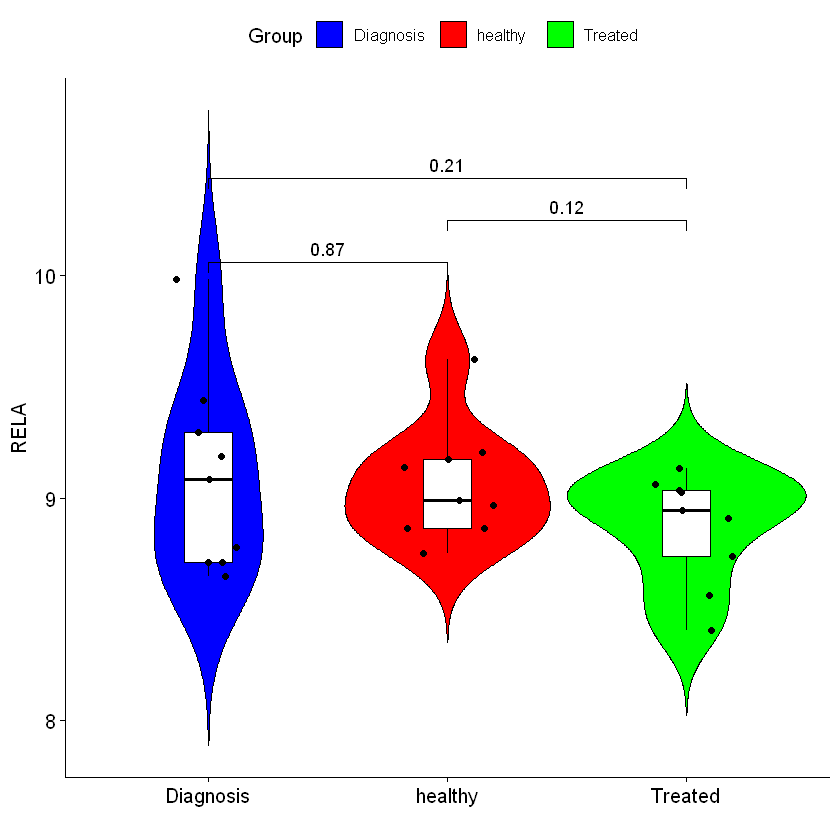
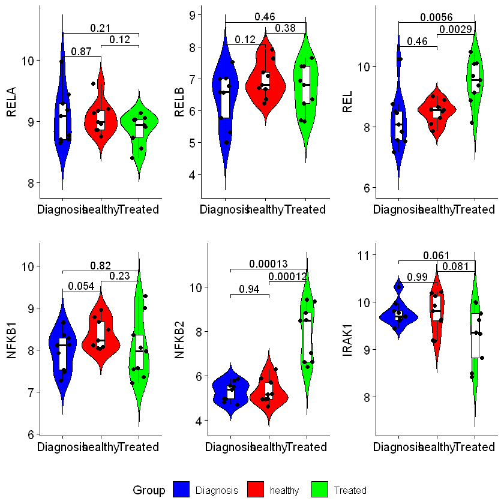

```R
options(warn=-1)
library(ggpubr) # if not working try install.packages('ggpubr') and load library(ggpubr) again
```

    Loading required package: ggplot2
    


```R
setwd(readClipboard()) #D:\neha\geo\GSE33075, copy the path in the clipboard `Ctrl+L` and then `Ctrl+C` or You can also use
#setwd('D:/neha/geo/GSE33075') # Look into the slashes [Not this `\`] correctly
```


```R
#Read the grouped gene expression data
data <- read.table("violin_boxplot.txt",sep="\t",header = TRUE)
head(data)
```


<table>
<thead><tr><th scope=col>ID</th><th scope=col>IRAK1</th><th scope=col>RELA</th><th scope=col>REL</th><th scope=col>NFKB1</th><th scope=col>RELB</th><th scope=col>NFKB2</th><th scope=col>Group</th></tr></thead>
<tbody>
	<tr><td>GSM817258</td><td>9.956719 </td><td>9.439500 </td><td> 8.089263</td><td>8.125484 </td><td>6.567551 </td><td>4.802172 </td><td>Diagnosis</td></tr>
	<tr><td>GSM818670</td><td>9.694319 </td><td>8.709168 </td><td> 8.750756</td><td>7.926007 </td><td>6.767505 </td><td>5.796439 </td><td>Diagnosis</td></tr>
	<tr><td>GSM818671</td><td>9.446790 </td><td>8.776640 </td><td> 7.564710</td><td>7.493332 </td><td>5.323061 </td><td>4.706549 </td><td>Diagnosis</td></tr>
	<tr><td>GSM818672</td><td>9.812024 </td><td>9.978626 </td><td>10.232190</td><td>8.287291 </td><td>7.533971 </td><td>5.860078 </td><td>Diagnosis</td></tr>
	<tr><td>GSM818673</td><td>9.607018 </td><td>8.649754 </td><td> 7.852839</td><td>7.523470 </td><td>4.992942 </td><td>4.984724 </td><td>Diagnosis</td></tr>
	<tr><td>GSM818674</td><td>9.623712 </td><td>9.084219 </td><td> 8.517581</td><td>8.115812 </td><td>6.998633 </td><td>5.556822 </td><td>Diagnosis</td></tr>
</tbody>
</table>


```R
#read genelists to be ploted
datax = read.delim("genes_to_be_plotted.txt", sep = '\t', header = T)
#Check the header of datax
head(datax)
#Convert as vectors
genes = as.vector(datax$Genes)
genes
```


<table>
<thead><tr><th scope=col>Genes</th></tr></thead>
<tbody>
	<tr><td>RELA </td></tr>
	<tr><td>RELB </td></tr>
	<tr><td>REL  </td></tr>
	<tr><td>NFKB1</td></tr>
	<tr><td>NFKB2</td></tr>
	<tr><td>IRAK1</td></tr>
</tbody>
</table>


<ol class=list-inline>
	<li>'RELA'</li>
	<li>'RELB'</li>
	<li>'REL'</li>
	<li>'NFKB1'</li>
	<li>'NFKB2'</li>
	<li>'IRAK1'</li>
</ol>


```R
#make the comparisons to be plotted
my_comparisons <- list( c("Diagnosis", "healthy"), 
                        c("Treated", "healthy"),
                        c("Treated", "Diagnosis") )
#Store it in comparisons
comparisons = my_comparisons
```


```R
ggviolin(data, x="Group", y="RELA", fill = "Group", xlab="", ylab= "RELA", palette = c("blue", "red", "green"),
        add = c("boxplot", "jitter"), add.params = list(fill = "white"))+ stat_compare_means(comparisons = my_comparisons, method='t.test')
ggsave('RELA_subunit.png', width=8, height=8, units="in", dpi=300)
```


    

    


```R
#save everything as single plot

p1=ggviolin(data, x="Group", y="RELA", fill = "Group", xlab="", ylab= "RELA", palette = c("blue", "red", "green"),
        add = c("boxplot", "jitter"), add.params = list(fill = "white"))+ stat_compare_means(comparisons = my_comparisons, method='t.test')

p2=ggviolin(data, x="Group", y="RELB", fill = "Group", xlab="", ylab= "RELB", palette = c("blue", "red", "green"),
        add = c("boxplot", "jitter"), add.params = list(fill = "white"))+ stat_compare_means(comparisons = my_comparisons, method='t.test')

p3=ggviolin(data, x="Group", y="REL", fill = "Group", xlab="", ylab= "REL", palette = c("blue", "red", "green"),
        add = c("boxplot", "jitter"), add.params = list(fill = "white"))+ stat_compare_means(comparisons = my_comparisons, method='t.test')

p4=ggviolin(data, x="Group", y="NFKB1", fill = "Group", xlab="", ylab= "NFKB1", palette = c("blue", "red", "green"),
        add = c("boxplot", "jitter"), add.params = list(fill = "white"))+ stat_compare_means(comparisons = my_comparisons, method='t.test')

p5=ggviolin(data, x="Group", y="NFKB2", fill = "Group", xlab="", ylab= "NFKB2", palette = c("blue", "red", "green"),
        add = c("boxplot", "jitter"), add.params = list(fill = "white"))+ stat_compare_means(comparisons = my_comparisons, method='t.test')

p6=ggviolin(data, x="Group", y="IRAK1", fill = "Group", xlab="", ylab= "IRAK1", palette = c("blue", "red", "green"),
        add = c("boxplot", "jitter"), add.params = list(fill = "white"))+ stat_compare_means(comparisons = my_comparisons, method='t.test')

ggarrange(p1, p2, p3, p4, p5, p6, common.legend = TRUE, legend = "bottom")
ggsave('NFKB_SUBUNIT.png', width=12, height=12, units="in", dpi=300)
```


    

    


```R

```

